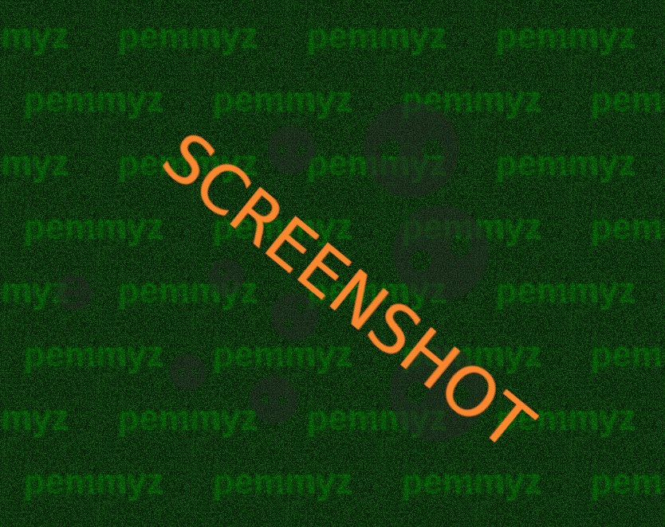

# js_elma_planck_v1

# Planck.js Fullscreen Physics (with Dynamic Background)

A fullscreen HTML5 canvas demo that combines:

- **Planck.js physics** (bouncing balls + walls)
- A **retro green “Pemmyz” tiled background**
- A simple **Options menu** to change start behavior, graphics style, and background text

Click the canvas to restart the simulation, or press **O** to open options.

A fullscreen HTML5 canvas demo powered by Planck.js, featuring a bouncy physics simulation with multiple ball sizes, smooth collision behavior, and a customizable retro-style green background. The project includes an in-game options menu to switch between different start behaviors, change ball rendering styles, and edit the background text live. Designed as a lightweight, no-build, browser-run physics + visual playground.


## Screenshots

### Game



---

## ✨ Features

### Physics simulation
- Fullscreen canvas physics using **Planck.js**
- 3×3 grid of balls (small / medium / big)
- Solid walls around the screen
- Balls use **high restitution** for bouncy motion
- Extra corner “nudge” logic prevents balls from getting stuck in corners

### Two start behaviors
- **New**: only the *top-left ball* starts moving
- **Old**: *all balls* start moving randomly

### Two graphics styles
- **New**: transparent grey balls with “cut-out” holes (destination-out)
- **Old**: colored balls with white border + darker hole outlines

### Dynamic tiled background
- Retro green tile pattern
- Custom background text (default: `pemmyz`)
- Press **A** to toggle animated noise on/off
- Automatically resizes and re-tiles based on screen size and text width

---

## 🎮 Controls

| Action | Control |
|-------|---------|
| Restart simulation | **Click** on the simulation canvas |
| Open/close options | **O** |
| Toggle background noise animation | **A** |
| Apply settings + restart | **Restart & Apply** button |

---

## 📁 Project Structure

Recommended layout:

```
project/
├─ index.html
├─ style.css
├─ script.js
└─ README.md
```

---

## ▶️ How to Run

### Option 1 (Simple)
Just open `index.html` in a modern browser.

### Option 2 (Recommended)
Run a small local web server (avoids some browser restrictions):

#### Python
```bash
python3 -m http.server 8000
```

Then open:
```
http://localhost:8000
```

---

## ⚙️ Dependencies

This project uses:

- **Planck.js** via CDN  
  Loaded in `index.html`:
  ```html
  <script src="https://cdn.jsdelivr.net/npm/planck-js@0.3.31/dist/planck.min.js"></script>
  ```

No build tools required.

---

## 🧠 Notes / Implementation Details

- Uses a fixed physics step of `1/60`.
- Uses `SCALE = 30` pixels-per-meter.
- Walls are thick (50px) to prevent tunneling.
- Balls are set as `bullet` bodies for more reliable collision at high speed.
- Background tile width is dynamic based on text width (so long text won’t be clipped).

---

## 💡 Customization Ideas

- Add more rows/columns of balls
- Add mouse drag interaction (Planck mouse joint)
- Add gravity toggle
- Add a background color picker
- Save settings in `localStorage`

---

## 📜 License

You can use this code freely for personal projects and demos.

(If you want, you can add an MIT License file.)
